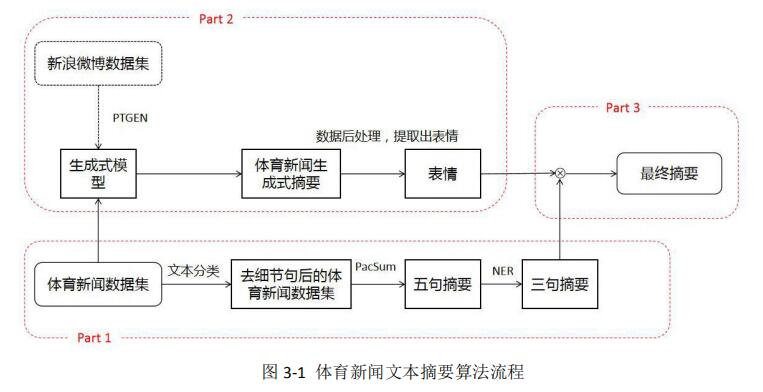
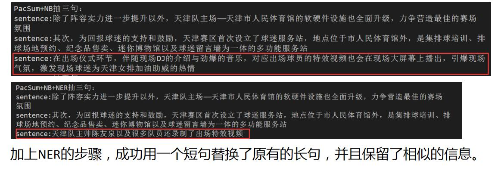
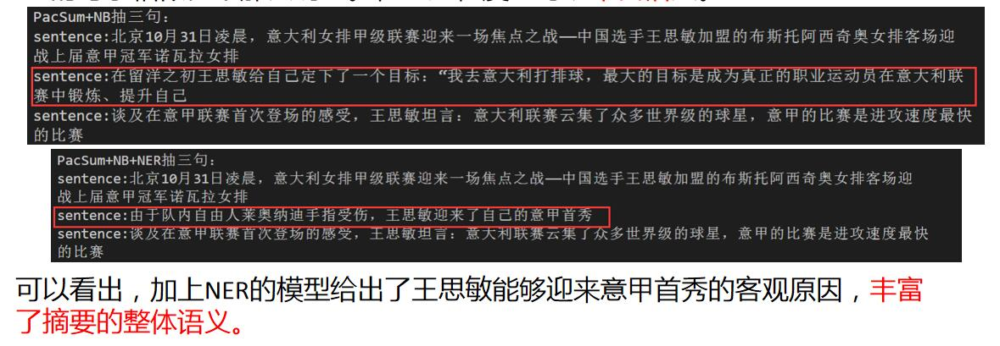
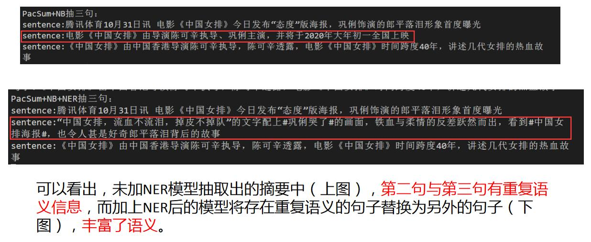

# 体育新闻文本摘要
## 1.前言
马上就要研究生开学了，于是想整理一下自己本科毕设做的东西。把一些数据还有算法的思路公开，希望能够对大家的项目有所启发吧。我毕业论文题目是《**面向体育新闻的摘要生成算法设计与实现**》，显而易见，就是在体育新闻文本上做了一个文摘的尝试。   

在正式介绍工作之前，需要知道文本摘要按照技术流派主要分为两大类：**抽取式文本摘要**与**生成式文本摘要**。其中抽取式文本摘要就是从源文档中抽取原有的句子以组成摘要，而生成式文本摘要则是把文摘任务看成NLG（自然语言生成）问题，利用seq2seq框架，编码原文并解码出摘要。

然后我设计的算法流程如下图所示：  
   
可以看到，主要分为三个部分，其中**part1是抽取式文本摘要部分，为算法的核心**；part2是生成式摘要部分，仅起到点缀作用；part3是将part1与part2的结果进行融合。下面分别会对这三个部分进行一个简短的介绍。

## 2. 抽取式摘要部分（part1）
在数据集方面，我们爬取了<u>[腾讯体育排球新闻](https://sports.qq.com/l/others/paiq/list201203611739.htm)</u>页面下的上万条排球体育新闻，去除一些过于简短的新闻以及组图类新闻，把每条新闻分好句。最后得到了包含9061条排球新闻的数据集```data/volleyball.csv```。为了评估各个摘要模型，我们又花费了很大的人力去标注了其中1000条新闻，形成了```data/TSN.csv```数据集（**T**ecent **S**ports **N**ews）。

### 2.1 细节句问题
因为中文长文本摘要目前数据集非常稀缺，再加上不同领域的文本有不同的风格，因此我们选用了无监督的抽取式摘要算法：```TextRank```与```PacSum```（<u>[Paper](https://arxiv.org/abs/1906.03508)</u>、<u>[Code](https://github.com/mswellhao/PacSum)</u>）。  

我们一开始在```data/volleyball.csv```上直接应用了上述的两个算法，发现其摘要的结果包含了很多描述比赛细节的句子。例如某个新闻通过```PacSum```模型得到的三句摘要为：```主攻王云蕗23分（23扣），主攻李盈莹18分（18扣），副攻袁心玥11分（6扣4拦1发），副攻高意7分（5扣1拦1发），接应刘晏含5分（3扣1拦1发），二传周妤婕4分（1扣2拦1发）```、
```10平后李盈莹反击短球打中11-10反超，12平后梅哈拉连抓快攻和探头、阿曼达反击成功、刘晏含一传送探头，巴西连夺4分16-12领先进入第二次技术暂停```、
```王云蕗强攻过轮后，袁心玥和刘晏含接连进攻被拦，巴西在第一次技术暂停8-5占先```。  

可以看出，摘要的结果并没有包含用户可能想要了解的核心信息，例如```是哪场比赛```、```比赛结果怎么样```等等。我们分析了原因：```PacSum```是基于```TextRank```的一个改进，两种算法都是基于图的排序模型，**在体育新闻当中，某些新闻会针对于某场具体的比赛进行细节方面的描述，而这些细节句有着较高的相似度与用词习惯，可能会让模型误以为这样的句子是重点句**。  

因此我们先利用文本分类方法，将每个句子分类成细节句与非细节句，然后把所有新闻当中的细节句全部去除掉，利用剩下的句子做摘要效果会好很多。具体地，我们标注了细节句分类数据集```data/细节句文本分类.csv```，并尝试了```朴素贝叶斯```、```TextCNN```以及```BertCNN```（<u>[Code](https://github.com/songyingxin/Bert-TextClassification)</u>）三种分类方法，最终的结果是```TextCNN```与```BertCNN```的效果差不多，但在**精确率**上都比```朴素贝叶斯```的92.86%高2~3个点左右。（我们设定细节句为1，非细节句为0。因此相比于召回率我们其实更关注精确率，因为一旦某一个非细节句被划分为细节句后将会被剔除掉，不参与后续的摘要过程，如果该句比较关键则会造成严重的后果；而如果把某一细节句识别成了非细节句，则问题大不。）  

### 2.2 信息量问题
我们在去除细节句后的数据集上使用```TextRank```或```PacSum```算法抽取其中的5句作为摘要，之后利用NER模型识别这5句中的```人名```、```组织名```以及```地名```，将实体识别结果数量最多的3句挑选出来以组成最后的摘要，若两句包含的实体数量一致则短句优先。  

这么做的原因是因为：我们假设包含实体数量越多的句子其语义信息越丰富（好吧，其实我只是想增加一下毕设的复杂度，但这么做完之后人工看了一下，发现效果还真的不错），短句优先是因为尽可能让摘要精简且含有实体数量越多的短句越有价值。  

这里我举几个例子，可以感受一下：  
   
   
   

关于NER模型：我当时使用的是<u>[BERT+LSTM+CRF](https://github.com/macanv/BERT-BiLSTM-CRF-NER)</u>，但如果要识别的是通用的类别（例如```人名```、```地名```等）其实可以直接使用现有的工具，例如<u>[Stanza](https://zhuanlan.zhihu.com/p/114550498)</u>。

## 2.3 总结
至此，我们完成了part1中的算法，其流程为：
1. 去除分好句的体育新闻中包含的细节句（描述比赛细节的句子）。  
2. 利用无监督抽取式摘要算法```TextRank```或```PacSum```抽取其中的5句组成初选摘要。
3. 利用NER模型计算初选摘要中每句话包含的实体数量，并挑选其中实体数量最多的三句以组成最终的摘要，若两句包含实体数量一致则短句优先。

## 3. 生成式摘要部分（part2）
我们使用了一个公开的新浪微博短文本摘要数据集```weibo_news```（不是哈工大LCSTS），这个数据集的特点在于其摘要部分会有表情标签。例如：```厉害了！这是我们老祖宗的智慧：10级地震中，故宫模型岿然不倒[威武]```这里的```[威武]```其实是新浪微博中的一个表情。  

我们在这个数据集上训练了PGN模型（<u>[Paper](https://arxiv.org/abs/1704.04368)</u>、<u>[Code](https://github.com/becxer/pointer-generator/)</u>），然后便可以利用训练好的模型直接应用于我们的数据集，这样模型产生的摘要部分通常便会含有表情标签，例如某新闻的摘要为：```朱婷反击！[威武][威武][哈哈][哈哈][哈哈]```。  

训练模型部分我参考了这篇文章：https://www.cnblogs.com/zingp/p/11571593.html    
其中数据集```weibo_news```也能从该文中找到（第四节）。

## 4. 融合部分（part3）
最终我们将生成式摘要部分（part2）得到结果中的表情标签保留下来，去重并拼接到抽取式摘要部分（part1）得到的结果之后来充当表情点缀作用。  

例如某体育新闻经过part1抽取式摘要部分得到的结果为```朱婷亮相天津女排出征仪式```、```随着强援的加盟和各方面支持力度的增强，球队在新赛季的综合实力有很大提升```、```在拥有三名国手的基础上，天津女排新赛季又招兵买马，将朱婷、胡克尔招致麾下```。  
而经过part2生成式摘要得到的结果为```回馈赞助商的支持和球迷的厚爱——渤海银行28日举行新赛季出征仪式[威武][威武][威武][威武][威武][威武]```  
那么最终的摘要便是：```朱婷亮相天津女排出征仪式。随着强援的加盟和各方面支持力度的增强，球队在新赛季的综合实力有很大提升。在拥有三名国手的基础上，天津女排新赛季又招兵买马，将朱婷、胡克尔招致麾下。[威武]```

## 5. 说明
- 我们标注的数据```data/TSN.csv```只有1000条，不足以训练有监督模型，只是能为我们提供一个实验结果的对比。
- 现在回过头来想想觉得其实没有必要标这1000条数据，因为我们可以不采用ROUGE作为实验的指标，而采用一些无监督的指标，例如：一个好的摘要与全文语义的相似度应该高于一个差的摘要与全文语义的相似度（Inspired by ```MatchSum```），设定好一个语义编码器之后就可以用这个方法来进行测评了。  
- 从学术的角度上来审视毕设的工作，确实没什么模型上的创新度，基本都是用现有的模型或者技术进行拼接式的操作，可以理解成为Pipeline吧。  
- 这个是我第一个完整意义上一个人从头到尾完成的算法项目，算是把文本摘要自己过了一遍，实践了```无监督抽取式文本摘要```、```有监督生成式文本摘要```、```命名实体识别```以及```文本分类```的模型，学到的东西还是挺多的。  
- 有关于实验结果，直接说结论吧：  
    - ```PacSum```的效果优于```TextRank```
    - 去除细节句之后再应用```PacSum```和```TextRank```比直接应用的效果在ROUGE指标上大幅度提升
    - 先利用无监督算法抽取5句，再通过NER筛选出3句的效果比直接利用无监督算法抽取3句在ROUGE指标上降低了2点，但人工评估的效果好很多，这是由于我们人工标注的时候可能过量参考新闻当中的某一句话所导致的，也就是我们人工标注的摘要结果信息量不是很足。